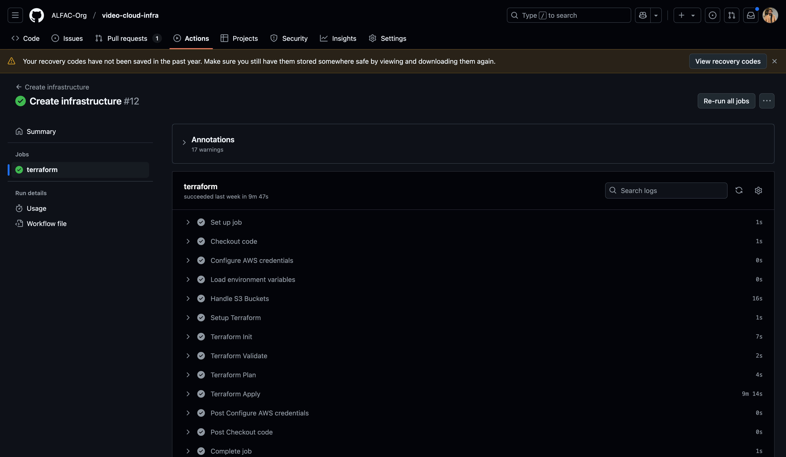

# Infraestrutura do Video Studio

Este é um repositório Git que utiliza o Terraform para gerenciar a infraestrutura da aplicação [Video Studio](https://github.com/ALFAC-Org/video-studio). Nele, você encontrará arquivos de configuração do Terraform que definem a infraestrutura como código. No momento, o repositório está focado na Amazon Web Services (AWS).

> [!WARNING]
> Para completo funcionamento da plataforma, é necessário seguir todo o fluxo de provisionamento:
> 1. A provisão deste repositório;
> 2. A provisão das lambdas [https://github.com/ALFAC-Org/video-serveless-function](https://github.com/ALFAC-Org/video-serveless-function)
> 2. A provisão da aplicação [https://github.com/ALFAC-Org/video-studio](https://github.com/ALFAC-Org/video-studio)

## Diagramas


## Como rodar o projeto

Variáveis a se trocar:

- ARN_AWS_LAB_ROLE
- AWS_ACCESS_KEY_ID
- AWS_SECRET_ACCESS_KEY
- AWS_SESSION_TOKEN
- AWS_BUCKET_NAME
- DB_IDENTIFIER
- DB_NAME
- DB_PASSWORD
- DB_USERNAME
- SUBNET_DATABASE_1_CIDR_BLOCK
- SUBNET_DATABASE_2_CIDR_BLOCK
- VPC_NAME

Existem duas formas com as quais você pode ver esse repositório em ação:

- **Via GitHub Actions (recomendada)**
- Localmente

### Via GitHub Actions (recomendada)

<details>
  <summary>Passo a passo</summary>

#### 1. Infraestrutura

1. Acesse [https://github.com/ALFAC-Org/video-cloud-infra/actions](https://github.com/ALFAC-Org/video-cloud-infra/actions) (A guia `Actions` deste repositório);
2. Acesse `Create infrastructure`;
3. Clique em `Run workflow` (ou Executar workflow);
4. Aguarde. Se tudo der certo, o `check` verde deverá aparecer - o processo dura em torno de 10 minutos;
   1. 

#### 2. Banco de dados

1. Acesse [https://github.com/ALFAC-Org/video-cloud-infra/actions](https://github.com/ALFAC-Org/video-cloud-infra/actions) (A guia `Actions` deste repositório);
2. Acesse `Create database`;
3. Clique em `Run workflow` (ou Executar workflow);
4. Aguarde. Se tudo der certo, o `check` verde deverá aparecer - o processo dura em torno de 10 minutos;
   1. 

</details>

### Localmente

<details>
  <summary>Passo a passo</summary>

#### Pré-requisitos

Antes de começar, certifique-se de ter os seguintes itens instalados e configurados em seu ambiente:

1. **Terraform**: A ferramenta que permite definir, visualizar e implantar a infraestrutura de nuvem.
2. **AWS CLI**: A interface de linha de comando da AWS.
3. **Credenciais AWS válidas**: Você precisará de uma chave de acesso e uma chave secreta para autenticar com a AWS (no momento, o repositório usa chaves e credenciais fornecidas pelo [AWS Academy](https://awsacademy.instructure.com/) e que divergem de contas padrão).

#### Como usar

1. **Clone este repositório**:

```bash
git clone https://github.com/ALFAC-Org/video-cloud-infra
```

2. **Acesse o diretório do repositório**:

```bash
cd video-cloud-infra
```

3. **Configure as credenciais AWS em seu ambiente**:

```bash
aws configure
```

4. Defina as variáveis necessárias ao nível de ambiente, via arquivo `.tfvars` ou passe através dos comandos necessários a cada pasta (`infrastructure`/`database`). Exemplo:

(lembre-se de executar o `terraform init` antes para cada pasta).

##### Para a pasta infrastructure

```bash
terraform apply -auto-approve \
-var "environment=$ENVIRONMENT" \
-var "aws_region=$AWS_REGION" \
-var "node_role_arn=$ARN_AWS_LAB_ROLE" \
-var "vpc_name=$VPC_NAME" \
-var "vpc_cidr_block=$VPC_CIDR_BLOCK" \
-var "subnet_private_1_cidr_block=$SUBNET_PRIVATE_1_CIDR_BLOCK" \
-var "subnet_private_2_cidr_block=$SUBNET_PRIVATE_2_CIDR_BLOCK" \
-var "subnet_public_1_cidr_block=$SUBNET_PUBLIC_1_CIDR_BLOCK" \
-var "subnet_public_2_cidr_block=$SUBNET_PUBLIC_2_CIDR_BLOCK" \
-var "subnet_availability_zone_az_1=$SUBNET_AVAILABILITY_ZONE_AZ_1" \
-var "subnet_availability_zone_az_2=$SUBNET_AVAILABILITY_ZONE_AZ_2" \
-var "kubernetes_namespace=$CLUSTER_NAMESPACE" \
-var "cluster_name=$CLUSTER_NAME"
```

##### Para a pasta database

```bash
terraform apply -auto-approve \
-var "aws_region=$AWS_REGION" \
-var "arn_aws_lab_role=$ARN_AWS_LAB_ROLE" \
-var "vpc_id=$VPC_ID" \
-var "subnet_database_1_cidr_block=$SUBNET_DATABASE_1_CIDR_BLOCK" \
-var "subnet_database_2_cidr_block=$SUBNET_DATABASE_2_CIDR_BLOCK" \
-var "subnet_availability_zone_az_1=$SUBNET_AVAILABILITY_ZONE_AZ_1" \
-var "subnet_availability_zone_az_2=$SUBNET_AVAILABILITY_ZONE_AZ_2" \
-var "db_username=$DB_USERNAME" \
-var "db_password=$DB_PASSWORD" \
-var "db_identifier=$DB_IDENTIFIER" \
-var "db_name=$DB_NAME" \
-var "cluster_sg_id=$CLUSTER_SG_ID"
```

</details>

### Acessando a aplicação

Para acessar a aplicação, é necessário fazer o deploy de [https://github.com/ALFAC-Org/video-studio/actions/workflows/deploy.yaml](https://github.com/ALFAC-Org/video-studio/actions/workflows/deploy.yaml). Após ver o `check` verde, basta acessar a `Action` que retorna o endpoint do `Swagger`.


## Membros

| Nome | RM | E-mail | GitHub |
| --- | --- | --- | --- |
| Leonardo Fraga | RM354771 | [rm354771@fiap.com.br](mailto:rm354771@fiap.com.br) | [@LeonardoFraga](https://github.com/LeonardoFraga) |
| Carlos Henrique Carvalho de Santana | RM355339 | [rm355339@fiap.com.br](mailto:rm355339@fiap.com.br) | [@carlohcs](https://github.com/carlohcs) |
| Leonardo Alves Campos | RM355568 | [rm355568@fiap.com.br](mailto:rm355568@fiap.com.br) | [@lcalves](https://github.com/lcalves) |
| Andre Musolino | RM355582 | [rm355582@fiap.com.br](mailto:rm355582@fiap.com.br) | [@amusolino](https://github.com/amusolino) |
| Caio Antunes Gonçalves | RM354913 | [rm354913@fiap.com.br](mailto:rm354913@fiap.com.br) | [@caio367](https://github.com/caio367) |
